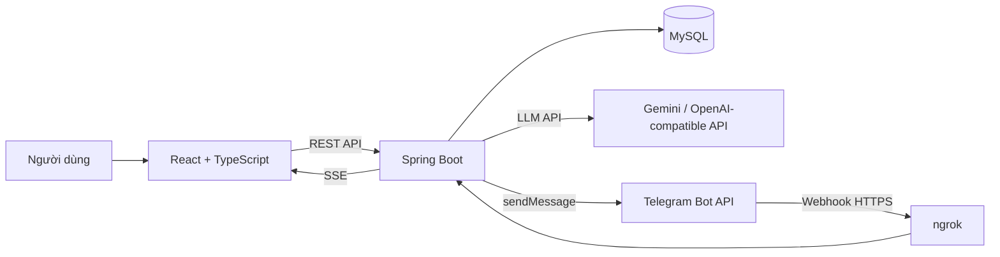

# CeramiFlow – Hệ thống điều phối & giám sát quy trình sản xuất xưởng gốm

CeramiFlow là một **Working MVP** cho bài toán quản lý và tự động hóa quy trình sản xuất gốm theo nhiều công đoạn liên tiếp. Hệ thống kết hợp **React**, **Spring Boot**, **MySQL**, **AI/LLM**, **Server-Sent Events (SSE)** và **Telegram Bot** để tiếp nhận đơn hàng, bóc tách thông số sản xuất, điều phối mẻ gốm, xử lý QC/rework, theo dõi tiến độ realtime và cho phép thợ/quản lý **xác nhận hoàn thành công đoạn ngay trên Telegram**.

> Mục tiêu chính của project là chứng minh luồng xử lý nghiệp vụ end-to-end, tính nhất quán của workflow, khả năng tích hợp AI và khả năng tự động hóa/thông báo theo thời gian thực; UI được giữ gọn, rõ ràng và phục vụ thao tác vận hành.

---

## 1. Bài toán

Một xưởng gốm nhận đơn hàng bằng mô tả tự nhiên, ví dụ:

```text
Đơn 200 bình gốm họa tiết sen men lam cao 35cm,
yêu cầu nung nhiệt độ cao 1280°C, hoàn thành trong 10 ngày.
```

Từ mô tả này, hệ thống cần:

1. Tiếp nhận đơn hàng trên Web.
2. Dùng AI để bóc tách/ước tính thông số sản xuất thành dữ liệu có cấu trúc.
3. Cho người dùng kiểm tra và chỉnh sửa kết quả AI trước khi xác nhận.
4. Tạo mẻ gốm và workflow sản xuất nhiều công đoạn.
5. Kiểm soát việc chuyển trạng thái bằng backend state machine, không cho phép bỏ qua công đoạn tùy ý.
6. Theo dõi mẻ gốm trên Dashboard/Kanban theo thời gian thực.
7. Thông báo tiến độ và cảnh báo qua Telegram.
8. Cho phép thợ/quản lý bấm nút trên Telegram để xác nhận hoàn thành công đoạn.
9. Ghi nhận QC, tính tỷ lệ lỗi và quyết định PASS / REWORK / REJECT.
10. Lưu audit log và lịch sử notification để truy vết.

---

## 2. Quy trình nghiệp vụ

### 2.1. Vòng đời đơn hàng

```text
Nhập mô tả đơn hàng
        ↓
CREATED
        ↓
AI phân tích
        ↓
READY_FOR_REVIEW
        ↓
Người dùng review/chỉnh sửa
        ↓
Xác nhận thông số
        ↓
Tạo Production Batch
```

AI **không trực tiếp thay đổi workflow sản xuất**. AI chỉ hỗ trợ biến dữ liệu không cấu trúc thành `ProductionSpecification`; các business rule và state transition được Java backend kiểm soát.

### 2.2. Quy trình sản xuất

Workflow mặc định:

```text
FORMING
   ↓
DRYING_REPAIR
   ↓
PAINTING
   ↓
GLAZING
   ↓
READY_FOR_KILN
   ↓
FIRING
   ↓
QC
   ↓
PACKAGING
   ↓
COMPLETED
```

Ý nghĩa nghiệp vụ:

| Trạng thái | Công đoạn |
|---|---|
| `FORMING` | Tạo hình mộc |
| `DRYING_REPAIR` | Phơi sấy & sửa mộc |
| `PAINTING` | Vẽ họa tiết |
| `GLAZING` | Tráng men |
| `READY_FOR_KILN` | Chuẩn bị vào lò |
| `FIRING` | Nung lò |
| `QC` | Kiểm định chất lượng |
| `PACKAGING` | Đóng gói |
| `COMPLETED` | Hoàn thành |

Backend dùng **state machine** để kiểm tra transition. Ví dụ:

```text
FORMING → DRYING_REPAIR     ✅ hợp lệ
FORMING → FIRING            ❌ không hợp lệ
FIRING → QC                 ✅ hợp lệ
QC → PACKAGING              ✅ khi QC đạt
```

### 2.3. QC và Rework

Tại QC, người vận hành nhập:

- số lượng kiểm tra;
- số lượng đạt;
- số lượng lỗi;
- loại lỗi;
- mức độ lỗi;
- ghi chú;
- người thực hiện.

Backend tính:

```text
defectRate = quantityFailed / quantityInspected × 100
```

Policy mặc định:

```text
defectRate < 3%       → PASS
3% ≤ defectRate < 10% → REWORK_REQUIRED
≥ 10%                 → REJECT
```

Hai ngưỡng này có thể thay đổi bằng biến môi trường:

```env
QC_PASS_THRESHOLD=3
QC_REWORK_THRESHOLD=10
```

Nếu cần rework, quản lý chọn công đoạn phù hợp để làm lại; workflow tiếp tục từ công đoạn đó rồi quay lại QC.

### 2.4. Telegram Inline Button

Với các công đoạn thông thường, Telegram gửi tin nhắn tiếng Việt tự nhiên kèm nút xác nhận, ví dụ:

```text
🟦 Mẻ gốm GOM-24-79782 đã được khởi tạo.
• Số lượng: 200 sản phẩm
• Công đoạn hiện tại: Tạo hình mộc

Khi hoàn tất công đoạn, thợ hoặc quản lý có thể bấm nút xác nhận ngay bên dưới.

[ ✅ Xác nhận hoàn thành Tạo hình mộc ]
```

Khi bấm nút:

```text
Telegram
    ↓ webhook
Spring Boot
    ↓ kiểm tra secret + batch + expected stage
Workflow Engine
    ↓
MySQL commit
    ├─ ProductionLog
    ├─ Notification mới
    └─ SSE event
            ↓
React tự cập nhật Dashboard/Kanban
```

**QC không có nút “hoàn thành” trên Telegram** vì QC cần nhập dữ liệu kiểm định chi tiết trên Web/API.

---

## 3. Kiến trúc hệ thống



### Thành phần chính

**Frontend**

- React 18 + TypeScript
- Vite
- Ant Design
- TanStack Query
- Axios
- React Router
- Recharts
- Server-Sent Events

**Backend**

- Java 21
- Spring Boot 3.3.4
- Spring Web / WebFlux
- Spring Data JPA
- Bean Validation
- MySQL 8
- Flyway
- OpenAPI / Swagger
- SSE realtime
- Optimistic locking (`@Version`)
- Persistent production logs & notifications

**AI**

- `AIExtractionService` abstraction
- LLM integration qua OpenAI-compatible API
- structured JSON parsing/validation
- retry + backoff
- rule-based fallback nếu AI không khả dụng
- human-in-the-loop trước khi tạo batch

**Telegram**

- outbound notification từ Java tới Telegram Bot API
- inline keyboard button
- webhook callback về backend
- webhook secret verification
- kiểm tra stale stage trước khi chuyển workflow

---

## 4. Mô hình dữ liệu chính

```text
ProductionOrder
    │
    ├── ProductionSpecification
    │
    └── ProductionBatch
            │
            ├── WorkflowStep
            ├── QcInspection
            ├── ProductionLog
            └── Notification
```

Các quyết định quan trọng:

- Một order chỉ tạo một production batch trong MVP.
- Workflow step được persist để theo dõi lịch sử từng công đoạn.
- Production log lưu audit trail cho các thay đổi quan trọng.
- Notification được persist và gửi bất đồng bộ; Telegram lỗi không rollback trạng thái sản xuất.
- `@Version` hỗ trợ optimistic locking để hạn chế cập nhật đồng thời gây trùng transition.
- SSE chỉ dùng để push dữ liệu server → browser; business logic vẫn ở backend.

---

## 5. Cấu trúc project

Project được tách thành 2 ứng dụng độc lập: **Spring Boot Backend** chịu trách nhiệm toàn bộ business logic, workflow, AI, persistence và Telegram; **React Frontend** tập trung vào nhập liệu, theo dõi tiến độ, QC và hiển thị realtime.

```text
ceramiflow/
├── ceramiflow-backend/
│   ├── src/
│   │   ├── main/
│   │   │   ├── java/com/ceramiflow/
│   │   │   │   ├── config/
│   │   │   │   ├── controller/
│   │   │   │   ├── domain/
│   │   │   │   ├── dto/
│   │   │   │   ├── exception/
│   │   │   │   ├── repository/
│   │   │   │   ├── service/
│   │   │   │   │   ├── ai/
│   │   │   │   │   ├── notification/
│   │   │   │   │   ├── realtime/
│   │   │   │   │   ├── telegram/
│   │   │   │   │   └── workflow/
│   │   │   │   └── CeramiFlowApplication.java
│   │   │   └── resources/
│   │   │       ├── db/migration/
│   │   │       │   └── V1__init_schema.sql
│   │   │       └── application.yml
│   │   └── test/
│   │       └── java/com/ceramiflow/service/workflow/
│   ├── pom.xml
│   ├── docker-compose.yml
│   ├── .env.example
│   └── CeramiFlow.postman.http
│
├── ceramiflow-frontend/
│   ├── src/
│   │   ├── api/
│   │   ├── components/
│   │   ├── constants/
│   │   ├── hooks/
│   │   ├── pages/
│   │   ├── styles/
│   │   ├── types/
│   │   ├── utils/
│   │   ├── App.tsx
│   │   └── main.tsx
│   ├── package.json
│   ├── vite.config.ts
│   └── .env.example
│
└── README.md
```

### 5.1. Backend – `ceramiflow-backend`

Backend là **trung tâm điều phối nghiệp vụ** của CeramiFlow. React và Telegram chỉ đóng vai trò client; mọi quy tắc quan trọng như chuyển công đoạn, QC, rework, tạo batch, kiểm tra trạng thái hợp lệ và lưu audit log đều được xử lý ở Spring Boot.

#### `config/` – cấu hình hệ thống

Chứa các class ánh xạ và cấu hình runtime:

- `AIProperties`: đọc các biến cấu hình AI như base URL, model, API key, retry và timeout.
- `TelegramProperties`: đọc token bot, chat ID và webhook secret của Telegram.
- `WorkflowProperties`: chứa các tham số nghiệp vụ có thể cấu hình, ví dụ ngưỡng QC.
- `CorsConfig`: cho phép React Frontend gọi REST API/SSE từ domain hoặc port khác trong môi trường local.

Mục tiêu của package này là tách cấu hình ra khỏi business logic để service không hard-code secret hoặc giá trị môi trường.

#### `controller/` – REST API, SSE và Telegram webhook

Đây là lớp giao tiếp bên ngoài của backend:

- `OrderController`: tạo đơn hàng, gọi AI phân tích, xác nhận thông số đơn hàng.
- `BatchController`: tạo batch từ order, lấy danh sách/detail batch, hoàn thành công đoạn, QC và rework.
- `DashboardController`: cung cấp dữ liệu tổng hợp cho dashboard.
- `SseController`: mở kết nối Server-Sent Events để push thay đổi trạng thái về React theo thời gian thực.
- `TelegramWebhookController`: nhận callback từ Telegram khi thợ/quản lý bấm nút **xác nhận hoàn thành công đoạn** ngay trong chat.

Controller chỉ nhận request, validate dữ liệu đầu vào và gọi service; business logic chính không đặt ở controller.

#### `domain/` – mô hình nghiệp vụ và JPA Entity

Đây là lớp mô tả các đối tượng cốt lõi của hệ thống:

- `ProductionOrder`: đơn hàng gốc do người dùng nhập bằng ngôn ngữ tự nhiên.
- `ProductionSpecification`: thông số kỹ thuật sau khi AI phân tích/xác nhận, gồm loại sản phẩm, men, họa tiết, kích thước, nguyên liệu ước tính, nhiệt độ nung, thời gian nung, deadline và priority.
- `ProductionBatch`: một mẻ sản xuất được tạo từ order; lưu trạng thái hiện tại, stage hiện tại và optimistic-locking `version`.
- `WorkflowStep`: từng công đoạn của batch, gồm trạng thái `PENDING / IN_PROGRESS / COMPLETED`, thời gian bắt đầu/kết thúc, operator và notes.
- `QcInspection`: kết quả kiểm định chất lượng, số lượng đạt/lỗi, defect rate, loại lỗi và quyết định QC.
- `ProductionLog`: audit trail của các thay đổi quan trọng trong quá trình sản xuất.
- `Notification`: hàng đợi thông báo; lưu nội dung, trạng thái gửi, số lần thử và lỗi gần nhất để Telegram failure không làm rollback workflow.

Các enum như `StageType`, `BatchStatus`, `OrderStatus`, `PriorityLevel`, `QcDecision`, `NotificationStatus` và `StepStatus` giúp backend dùng state có kiểm soát thay vì truyền chuỗi tự do.

#### `dto/` – request/response contract

DTO tách JSON API khỏi JPA Entity và tránh expose trực tiếp cấu trúc database:

- `CreateOrderRequest`, `ConfirmOrderRequest`: input cho luồng tạo và xác nhận order.
- `ExtractedSpecDto`: schema có cấu trúc mà AI phải trả về.
- `BatchActionRequest`: dữ liệu người vận hành khi hoàn thành một công đoạn.
- `QcInspectionRequest`, `ReworkRequest`: input cho QC và rework.
- `OrderResponse`, `BatchResponse`, `WorkflowStepResponse`, `QcInspectionResponse`, `ProductionLogResponse`, `NotificationResponse`: dữ liệu trả cho React.
- `DashboardSummary`: dữ liệu thống kê tổng hợp cho dashboard.

#### `repository/` – truy cập MySQL

Sử dụng Spring Data JPA để truy vấn/persist dữ liệu cho:

- orders,
- specifications,
- production batches,
- workflow steps,
- QC inspections,
- production logs,
- notifications.

`ProductionBatchRepository` cũng hỗ trợ đọc batch phục vụ cập nhật workflow an toàn; entity `ProductionBatch` sử dụng optimistic locking để giảm nguy cơ hai request đồng thời hoàn thành cùng một công đoạn.

#### `service/ai/` – tích hợp AI và fallback

AI được tách qua abstraction:

```text
AIExtractionService
├── LLMExtractionService
└── RuleBasedExtractionService
```

- `LLMExtractionService`: gửi mô tả đơn hàng tới LLM qua OpenAI-compatible API, yêu cầu structured JSON, parse và validate output, có retry/backoff/timeout.
- `RuleBasedExtractionService`: fallback khi LLM không khả dụng, timeout hoặc API gặp lỗi; giúp demo vẫn tiếp tục được thay vì làm dừng toàn bộ quy trình.
- `AIExtractionService`: interface giúp business layer không phụ thuộc trực tiếp vào một provider AI cụ thể.

Luồng AI:

```text
Mô tả đơn hàng
    ↓
LLM Extraction
    ↓
Structured JSON
    ↓
Backend validation
    ↓
ProductionSpecification
    ↓
Human review / confirm
```

AI chỉ hỗ trợ phân tích và ước tính; **AI không được tự ý chuyển workflow hay ghi trực tiếp trạng thái sản xuất**. Quyết định nghiệp vụ cuối cùng vẫn do Java backend kiểm soát.

#### `service/workflow/` – lõi nghiệp vụ của hệ thống

Đây là package quan trọng nhất của backend:

- `ProductionOrderService`: quản lý lifecycle của order, gọi AI, lưu specification và xác nhận order.
- `ProductionBatchService`: tạo batch, khởi tạo toàn bộ workflow, hoàn thành stage, ghi QC, xử lý rework, phát event realtime và tạo notification.
- `WorkflowStateMachine`: định nghĩa transition hợp lệ giữa các công đoạn; ngăn client nhảy tùy ý từ `FORMING` sang `FIRING` hoặc bỏ qua stage.
- `QcPolicy`: tính defect rate và đưa ra quyết định `PASS / REWORK_REQUIRED / REJECT` theo business rule.
- `AuditService`: ghi `ProductionLog` cho các sự kiện quan trọng.
- `DashboardService`: tổng hợp số liệu phục vụ dashboard.

Manufacturing state machine được kiểm soát tại backend:

```text
FORMING
  ↓
DRYING_REPAIR
  ↓
PAINTING
  ↓
GLAZING
  ↓
READY_FOR_KILN
  ↓
FIRING
  ↓
QC
  ├── PASS → PACKAGING → COMPLETED
  └── FAIL → REWORK_REQUIRED → quay lại công đoạn phù hợp
```

Điều này đảm bảo React và Telegram đều dùng **cùng một Workflow Engine**, không có hai nguồn business logic khác nhau.

#### `service/notification/` – hàng đợi và gửi thông báo

- `NotificationService`: abstraction để business layer tạo thông báo mà không phụ thuộc cách gửi cụ thể.
- `PersistentNotificationService`: ghi notification vào MySQL ở trạng thái chờ gửi.
- `TelegramDeliveryWorker`: worker chạy nền, đọc notification `PENDING/FAILED`, gửi qua Telegram và cập nhật `SENT/FAILED/SKIPPED`.

Thiết kế này giúp lỗi mạng Telegram không rollback transaction sản xuất.

#### `service/telegram/` – Telegram Bot + Inline Button

Package này xử lý giao tiếp trực tiếp với Telegram Bot API:

- `TelegramBotClient`: gửi message, inline keyboard, callback acknowledgement và cập nhật/xóa button.
- `TelegramMessageFactory`: tạo nội dung thông báo **tiếng Việt tự nhiên** theo ngữ cảnh từng sự kiện.
- `TelegramStageText`: chuyển enum kỹ thuật như `DRYING_REPAIR` thành nhãn nghiệp vụ như **“Phơi sấy & sửa mộc”**.

Ví dụ message:

```text
✅ Mẻ gốm GOM-24-79782 đã hoàn thành công đoạn Tạo hình mộc.
➡️ Chuyển sang: Phơi sấy & sửa mộc.

[ ✅ Hoàn thành phơi sấy & sửa mộc ]
```

Khi người dùng bấm button:

```text
Telegram
   ↓ webhook
TelegramWebhookController
   ↓
ProductionBatchService
   ↓
WorkflowStateMachine
   ↓
MySQL + Audit Log
   ↓
Notification + SSE
```

Riêng `QC` không dùng nút "Hoàn thành" đơn giản vì cần nhập số lượng kiểm tra, số lượng lỗi, defect type và severity trước khi backend ra quyết định.

#### `service/realtime/` – cập nhật UI realtime bằng SSE

- `RealtimeEventPublisher`: quản lý các browser đang subscribe và gửi event.
- `BatchChangedEvent`: event nội bộ mô tả batch vừa thay đổi.
- `RealtimeAfterCommitListener`: chỉ push SSE sau khi transaction database đã commit thành công.

Nhờ đó, khi thợ bấm button Telegram hoặc người dùng thao tác trên FE, Kanban/Dashboard có thể cập nhật mà không cần reload trang.

#### `exception/` – xử lý lỗi tập trung

- `BusinessException`: lỗi business rule, ví dụ transition không hợp lệ.
- `NotFoundException`: resource không tồn tại.
- `AIExtractionException`: AI/parse lỗi.
- `GlobalExceptionHandler`: chuẩn hóa HTTP error response và xử lý client disconnect của SSE mà không làm workflow bị coi là thất bại.

#### `resources/`

- `application.yml`: datasource MySQL, JPA/Flyway, AI, Telegram, CORS và workflow configuration; giá trị nhạy cảm lấy từ environment variables.
- `db/migration/V1__init_schema.sql`: Flyway migration tạo schema ban đầu. Hibernate chạy ở chế độ `validate` để phát hiện Entity và DB không đồng bộ thay vì tự ý sửa schema production.

#### `src/test/`

Hiện chứa unit test cho các business rule quan trọng:

- `WorkflowStateMachineTest`: kiểm tra transition hợp lệ/không hợp lệ.
- `QcPolicyTest`: kiểm tra cách hệ thống đưa ra quyết định QC từ defect rate.

Đây là các test ưu tiên vì workflow và QC là core logic của bài toán.

#### Các file ở root backend

- `pom.xml`: dependency và build configuration của Maven.
- `docker-compose.yml`: khởi động MySQL local nhanh bằng Docker.
- `.env.example`: mẫu các biến môi trường cần cấu hình; file `.env` thật không được commit.
- `CeramiFlow.postman.http`: tập request mẫu để test API nhanh ngoài Frontend.

### 5.2. Frontend – `ceramiflow-frontend`

Frontend là React SPA, chịu trách nhiệm trải nghiệm người dùng và trực quan hóa dữ liệu; business rules vẫn được xác thực ở backend.

- `api/`: Axios client và các hàm gọi Orders, Batches, Dashboard.
- `pages/`: các màn hình `Dashboard`, `Create Order`, `Orders`, `Production Kanban`, `Batch Detail`, `QC`, `Activity Logs`.
- `components/`: component tái sử dụng cho layout, batch card, specification form, metric card và common UI.
- `hooks/useRealtimeUpdates.ts`: subscribe SSE `/api/stream` và yêu cầu TanStack Query refresh data khi backend phát event.
- `constants/workflow.ts`: metadata hiển thị cho các công đoạn; không chứa logic quyết định transition.
- `types/api.ts`: TypeScript types phản ánh contract từ backend.
- `utils/`: format dữ liệu và ánh xạ trạng thái sang nhãn UI.

Luồng giao tiếp chính:

```text
React UI
   ├── REST API ───────────────→ Spring Boot
   └── EventSource / SSE ←───── Spring Boot

Telegram
   ├── Bot notification ←────── Spring Boot
   └── Inline-button webhook ──→ Spring Boot
```

Nhờ cách tách này, dù thao tác xuất phát từ Web hay Telegram, **MySQL + Java Workflow Engine vẫn là source of truth duy nhất**.

Nếu frontend/backend nằm ở hai repository riêng, cấu trúc logic và các bước cài đặt bên dưới vẫn tương tự.

---

# 6. Hướng dẫn chạy local

## 6.1. Yêu cầu môi trường

Cài trước:

- **Java 21**
- **Maven 3.9+**
- **Node.js 20 LTS+** và npm
- **MySQL 8.x** hoặc Docker Desktop
- Git
- ngrok (cần cho Telegram Inline Button khi chạy local)
- Một Telegram Bot + chat/group ID
- API key AI nếu muốn dùng LLM thật; nếu để trống, backend có thể dùng rule-based fallback

Kiểm tra nhanh:

```bash
java -version
mvn -version
node -v
npm -v
mysql --version
ngrok version
```

---

## 6.2. Khởi động MySQL

### Cách A – dùng Docker Compose

Trong thư mục backend:

```bash
docker compose up -d
```

`docker-compose.yml` hiện tạo:

```text
MySQL: localhost:3306
Database: ceramiflow
Username: root
Password: 123456
```

Kiểm tra:

```bash
docker compose ps
```

Dừng database:

```bash
docker compose down
```

Muốn xóa luôn volume dữ liệu:

```bash
docker compose down -v
```

### Cách B – MySQL cài trực tiếp

Có thể tạo database thủ công:

```sql
CREATE DATABASE IF NOT EXISTS ceramiflow
CHARACTER SET utf8mb4
COLLATE utf8mb4_unicode_ci;
```

Flyway sẽ tạo/validate schema khi backend khởi động.

---

## 6.3. Cấu hình Backend

Trong `ceramiflow-backend`, copy:

**PowerShell**

```powershell
Copy-Item .env.example .env
```

**macOS/Linux**

```bash
cp .env.example .env
```

Ví dụ `.env`:

```env
# MySQL
DB_HOST=localhost
DB_PORT=3306
DB_NAME=ceramiflow
DB_USERNAME=root
DB_PASSWORD=root

# AI - có thể để AI_API_KEY trống để dùng fallback
AI_ENABLED=true
AI_BASE_URL=https://generativelanguage.googleapis.com/v1beta/openai
AI_API_KEY=YOUR_AI_API_KEY
AI_MODEL=YOUR_AVAILABLE_GEMINI_MODEL
AI_MAX_RETRIES=2
AI_RETRY_BACKOFF_MS=800
AI_TIMEOUT_SECONDS=60

# Telegram
TELEGRAM_ENABLED=true
TELEGRAM_BOT_TOKEN=YOUR_TELEGRAM_BOT_TOKEN
TELEGRAM_CHAT_ID=YOUR_TELEGRAM_CHAT_ID
TELEGRAM_WEBHOOK_SECRET=CHANGE_TO_A_RANDOM_SECRET

# QC
QC_PASS_THRESHOLD=3
QC_REWORK_THRESHOLD=10
```

### Chạy bằng IntelliJ IDEA trên Windows

Spring Boot không tự đọc file `.env`. Nếu dùng plugin **EnvFile**:

1. `Run` → `Edit Configurations...`
2. Chọn `CeramiFlowApplication`.
3. Bật `Enable EnvFile`.
4. Nhấn `+` và chọn file `.env` trong thư mục backend.
5. `Apply` → `OK`.
6. Run application.

### Chạy bằng Maven

Nếu các environment variable đã được export/set trong terminal:

```bash
mvn clean test
mvn spring-boot:run
```

Backend mặc định chạy tại:

```text
http://localhost:8080
```

Swagger:

```text
http://localhost:8080/swagger-ui.html
```

Health check:

```text
http://localhost:8080/actuator/health
```

### Lấy token Telegram
Xem cụ thể ở mục 8
---

## 6.4. Cấu hình Frontend

Trong `ceramiflow-frontend`, copy `.env.example`:

**PowerShell**

```powershell
Copy-Item .env.example .env
```

Nội dung:

```env
VITE_API_BASE_URL=http://localhost:8080
```

Cài dependency và chạy:

```bash
npm install
npm run dev
```

Frontend mặc định:

```text
http://localhost:5173
```

Build production:

```bash
npm run build
npm run preview
```

---

# 7. Cài đặt ngrok cho Telegram webhook

## 7.1. Vì sao cần ngrok?

Việc backend **gửi** Telegram message chỉ cần kết nối outbound:

```text
Spring Boot → Telegram
```

Nhưng khi người dùng bấm Inline Button, Telegram phải gọi ngược vào backend:

```text
Telegram → HTTPS public URL → Spring Boot
```

Telegram không thể gọi `http://localhost:8080`, do đó khi chạy local cần một HTTPS public tunnel. Project sử dụng **ngrok** cho mục đích này.

## 7.2. Cài ngrok trên Windows

1. Tạo tài khoản ngrok.
2. Cài ngrok bằng Microsoft Store/WinGet hoặc tải agent từ trang ngrok.
3. Lấy **authtoken** trong ngrok dashboard.
4. Mở PowerShell và chạy:

```powershell
ngrok config add-authtoken "YOUR_NGROK_AUTHTOKEN"
```

Chỉ cần cấu hình authtoken một lần trên máy.

## 7.3. Expose backend port 8080

Đảm bảo Spring Boot đang chạy trước, sau đó mở terminal mới:

```powershell
ngrok http 8080
```

Ví dụ output:

```text
Session Status    online
Forwarding        https://your-random-domain.ngrok-free.dev -> http://localhost:8080
```

Public backend URL lúc này là:

```text
https://your-random-domain.ngrok-free.dev
```

Có thể kiểm tra bằng:

```text
https://your-random-domain.ngrok-free.dev/swagger-ui.html
```

Dashboard inspect request của ngrok:

```text
http://127.0.0.1:4040
```

---

# 8. Cấu hình Telegram Bot + Webhook

## 8.1. Tạo Telegram Bot và lấy Bot Token

Backend cần một Telegram Bot để gửi thông báo và nhận callback khi thợ/quản lý bấm Inline Button.

### Bước 1 – Tạo bot bằng BotFather

1. Mở Telegram và tìm tài khoản chính thức **@BotFather**.
2. Gửi lệnh:

```text
/newbot
```

3. BotFather sẽ yêu cầu:
   - **Name**: tên hiển thị của bot, ví dụ `CeramiFlow Bot`.
   - **Username**: username duy nhất và phải kết thúc bằng `bot`, ví dụ `ceramiflow_demo_bot`.
4. Sau khi tạo thành công, BotFather trả về một **Bot Token** có dạng:

```text
1234567890:AAxxxxxxxxxxxxxxxxxxxxxxxxxxxxxxxxx
```

5. Lưu token này vào `.env`:

```env
TELEGRAM_BOT_TOKEN=YOUR_BOT_TOKEN
```

> **Không commit Bot Token lên GitHub, không đưa token thật vào README, screenshot hoặc video demo. Nếu token bị lộ, hãy dùng BotFather để revoke/regenerate token trước khi tiếp tục sử dụng.**

### Bước 2 – Kiểm tra Bot Token

Có thể kiểm tra token bằng Telegram Bot API:

**Windows PowerShell**

```powershell
curl.exe "https://api.telegram.org/botYOUR_BOT_TOKEN/getMe"
```

Nếu token hợp lệ, response có dạng:

```json
{
  "ok": true,
  "result": {
    "is_bot": true,
    "username": "ceramiflow_demo_bot"
  }
}
```

---

## 8.2. Lấy Telegram Chat ID

`TELEGRAM_CHAT_ID` xác định nơi CeramiFlow sẽ gửi thông báo. Có thể dùng **chat cá nhân** hoặc **Telegram group**.

### Cách A – Lấy Chat ID của chat cá nhân

1. Mở bot vừa tạo trên Telegram.
2. Nhấn **Start** hoặc gửi một tin nhắn bất kỳ cho bot.
3. Trước khi cấu hình webhook, chạy:

```powershell
curl.exe "https://api.telegram.org/botYOUR_BOT_TOKEN/getUpdates"
```

4. Trong JSON response, tìm:

```json
{
  "message": {
    "chat": {
      "id": 123456789,
      "type": "private"
    }
  }
}
```

Giá trị:

```text
123456789
```

chính là `TELEGRAM_CHAT_ID`.

Cấu hình:

```env
TELEGRAM_CHAT_ID=123456789
```

### Cách B – Lấy Chat ID của Telegram group

1. Tạo hoặc mở group dùng để nhận thông báo CeramiFlow.
2. Thêm bot vừa tạo vào group.
3. Gửi một command trong group, ví dụ:

```text
/start@ceramiflow_demo_bot
```

Thay `ceramiflow_demo_bot` bằng username bot của bạn.

4. Chạy:

```powershell
curl.exe "https://api.telegram.org/botYOUR_BOT_TOKEN/getUpdates"
```

5. Tìm object:

```json
{
  "message": {
    "chat": {
      "id": -1001234567890,
      "title": "CeramiFlow Workshop",
      "type": "supergroup"
    }
  }
}
```

Giá trị:

```text
-1001234567890
```

là Chat ID của group.

Cấu hình:

```env
TELEGRAM_CHAT_ID=-1001234567890
```

> Chat ID của group/supergroup thường là số âm. Hãy copy **nguyên giá trị**, bao gồm cả dấu `-`.

### Nếu `getUpdates` không trả dữ liệu

Telegram không cho sử dụng `getUpdates` đồng thời với webhook. Nếu bot đã được cấu hình webhook trước đó, có thể tạm xóa webhook:

```powershell
curl.exe "https://api.telegram.org/botYOUR_BOT_TOKEN/deleteWebhook"
```

Sau đó:

1. gửi lại một tin nhắn hoặc command cho bot/group;
2. gọi lại `getUpdates`;
3. lấy `chat.id`;
4. cấu hình lại webhook theo mục **8.5** bên dưới.

### Kiểm tra Bot Token + Chat ID bằng một tin nhắn thử

Sau khi có cả token và chat ID:

```powershell
curl.exe -X POST "https://api.telegram.org/botYOUR_BOT_TOKEN/sendMessage" `
  -d "chat_id=YOUR_TELEGRAM_CHAT_ID" `
  -d "text=CeramiFlow Telegram test OK"
```

Nếu Telegram nhận được tin nhắn, `TELEGRAM_BOT_TOKEN` và `TELEGRAM_CHAT_ID` đã đúng.

---

## 8.3. Cấu hình biến môi trường Telegram

Backend cần:

```env
TELEGRAM_ENABLED=true
TELEGRAM_BOT_TOKEN=YOUR_BOT_TOKEN
TELEGRAM_CHAT_ID=YOUR_CHAT_OR_GROUP_ID
TELEGRAM_WEBHOOK_SECRET=YOUR_RANDOM_SECRET
```

Có thể tạo webhook secret ngẫu nhiên bằng PowerShell:

```powershell
[guid]::NewGuid().ToString("N")
```

Ví dụ:

```env
TELEGRAM_WEBHOOK_SECRET=5b64d38bc44e4e97a37ac7f06619caa3
```

Nếu dùng group Telegram, hãy đảm bảo bot vẫn còn trong group và có quyền gửi message.

---

## 8.4. Quan hệ giữa Telegram, Backend và ngrok

Khi CeramiFlow chỉ gửi thông báo:

```text
Spring Boot → Telegram Bot API → Telegram Chat
```

Nhưng Inline Button cần callback theo chiều ngược lại:

```text
Thợ / Quản lý bấm nút
        ↓
Telegram
        ↓ HTTPS Webhook
ngrok public URL
        ↓
Spring Boot
        ↓
Workflow State Machine
        ↓
MySQL + ProductionLog + Notification
        ↓
SSE → React cập nhật realtime
```

Do Telegram không thể gọi trực tiếp `localhost:8080`, khi chạy local cần ngrok hoặc một public HTTPS endpoint tương đương.

---

## 8.5. Đăng ký webhook

Giả sử ngrok trả về:

```text
https://your-random-domain.ngrok-free.dev
```

Webhook CeramiFlow là:

```text
https://your-random-domain.ngrok-free.dev/api/integrations/telegram/webhook
```

### Windows PowerShell

```powershell
curl.exe -X POST "https://api.telegram.org/botYOUR_BOT_TOKEN/setWebhook" `
  -d "url=https://your-random-domain.ngrok-free.dev/api/integrations/telegram/webhook" `
  -d "secret_token=YOUR_TELEGRAM_WEBHOOK_SECRET"
```

`secret_token` phải **giống chính xác** `TELEGRAM_WEBHOOK_SECRET` trong backend.

Response thành công thường có:

```json
{
  "ok": true,
  "result": true
}
```

---

## 8.6. Kiểm tra webhook

Có thể gọi trực tiếp Telegram:

```powershell
curl.exe "https://api.telegram.org/botYOUR_BOT_TOKEN/getWebhookInfo"
```

Kết quả cần có URL hiện tại, ví dụ:

```json
{
  "ok": true,
  "result": {
    "url": "https://your-random-domain.ngrok-free.dev/api/integrations/telegram/webhook",
    "pending_update_count": 0
  }
}
```

Hoặc dùng endpoint debug của backend:

```text
GET http://localhost:8080/api/integrations/telegram/webhook-info
```

Nếu bot gửi message được nhưng bấm Inline Button không có phản hồi:

1. kiểm tra URL trong `getWebhookInfo`;
2. kiểm tra ngrok còn chạy;
3. kiểm tra `TELEGRAM_WEBHOOK_SECRET` có giống `secret_token` khi gọi `setWebhook`;
4. mở ngrok inspector để xem Telegram có gửi callback tới máy hay không:

```text
http://127.0.0.1:4040
```

Khi bấm Inline Button, cần thấy request:

```text
POST /api/integrations/telegram/webhook
```

---

## 8.7. Lưu ý khi dùng ngrok Free

- Giữ cửa sổ `ngrok http 8080` luôn chạy trong lúc demo.
- URL public có thể thay đổi khi restart ngrok.
- Nếu URL thay đổi, phải gọi `setWebhook` lại với URL mới.
- Có thể xem request callback từ Telegram tại `http://127.0.0.1:4040`.
- Nếu bot gửi message được nhưng bấm button không phản ứng, kiểm tra đầu tiên là `getWebhookInfo` và ngrok inspector.
- Nên kiểm tra `sendMessage` trước khi cấu hình webhook để tách biệt lỗi **Bot Token/Chat ID** với lỗi **webhook/ngrok**.

---

# 9. API chính

## Orders

```text
POST /api/orders
POST /api/orders/{id}/analyze
POST /api/orders/{id}/confirm
GET  /api/orders
GET  /api/orders/{id}
```

Tạo order:

```json
{
  "description": "Đơn 200 Bình gốm họa tiết sen men lam cao 35cm, yêu cầu nung nhiệt độ cao 1280°C, hoàn thành trong 10 ngày"
}
```

## Batches

```text
POST /api/batches/from-order/{orderId}?actor=...
GET  /api/batches
GET  /api/batches/{id}
POST /api/batches/{id}/steps/complete
POST /api/batches/{id}/qc
POST /api/batches/{id}/rework
GET  /api/batches/{id}/logs
GET  /api/batches/{id}/notifications
```

Hoàn thành công đoạn từ Web:

```json
{
  "operator": "Thong",
  "notes": "Đã hoàn thành công đoạn"
}
```

QC mẫu:

```json
{
  "quantityInspected": 200,
  "quantityPassed": 190,
  "quantityFailed": 10,
  "defectType": "Nứt men",
  "severity": "HIGH",
  "notes": "Phát hiện nứt men sau nung",
  "operator": "QC-01"
}
```

Rework mẫu:

```json
{
  "targetStage": "GLAZING",
  "operator": "QuanLyXuong",
  "notes": "Tráng men lại các sản phẩm lỗi"
}
```

## Dashboard / Realtime / Telegram

```text
GET  /api/dashboard/summary
GET  /api/stream
POST /api/integrations/telegram/webhook
GET  /api/integrations/telegram/webhook-info
```

---

# 10. Demo end-to-end đề xuất

1. Chạy MySQL.
2. Chạy Spring Boot tại `localhost:8080`.
3. Chạy React tại `localhost:5173`.
4. Chạy `ngrok http 8080` và đăng ký Telegram webhook.
5. Mở màn hình **Tạo đơn mới**.
6. Nhập:

```text
Đơn 200 Bình gốm họa tiết sen men lam cao 35cm,
yêu cầu nung nhiệt độ cao 1280°C, hoàn thành trong 10 ngày.
```

7. Bấm **Phân tích với AI**.
8. Review/chỉnh sửa specification.
9. Xác nhận và tạo production batch.
10. Telegram nhận message cho công đoạn `Tạo hình mộc` kèm Inline Button.
11. Có thể chuyển công đoạn từ FE **hoặc** bấm nút Telegram; cả hai đều đi qua cùng backend Workflow Engine.
12. Quan sát Kanban/Dashboard cập nhật realtime qua SSE.
13. Khi đến QC, nhập `200 inspected / 190 passed / 10 failed`, loại lỗi `Nứt men`.
14. Backend tính defect rate 5% và chuyển sang `REWORK_REQUIRED` theo policy mặc định.
15. Chọn công đoạn rework, tiếp tục sản xuất.
16. QC PASS → `PACKAGING` → `COMPLETED`.
17. Kiểm tra Production Logs và Notification history.

---

# 11. Xử lý lỗi thường gặp

### Backend báo `Schema-validation`

Đảm bảo database schema được tạo bởi Flyway và không dùng lại schema cũ không tương thích. Với môi trường local test có thể reset DB/volume rồi chạy lại migration.

### AI timeout / 429 / 503

Backend có retry và fallback. Kiểm tra:

```env
AI_API_KEY
AI_BASE_URL
AI_MODEL
AI_TIMEOUT_SECONDS
```

AI provider có thể tạm thời quá tải; không nên để lỗi AI làm dừng toàn bộ manufacturing workflow.

### Telegram notification là `SKIPPED`

Kiểm tra:

```env
TELEGRAM_ENABLED=true
TELEGRAM_BOT_TOKEN=...
TELEGRAM_CHAT_ID=...
```

### Bot gửi message nhưng Inline Button không hoạt động

Kiểm tra:

1. `ngrok http 8080` còn chạy không.
2. `getWebhookInfo` có đúng URL ngrok mới nhất không.
3. `TELEGRAM_WEBHOOK_SECRET` có khớp với `secret_token` khi `setWebhook` không.
4. Mở `http://127.0.0.1:4040` xem Telegram có gửi `POST /api/integrations/telegram/webhook` tới máy không.
5. Nếu restart ngrok và URL đổi, chạy `setWebhook` lại.

### FE chuyển công đoạn nhưng realtime bị disconnect

SSE client có thể reconnect khi browser reload/chuyển trang. Business transaction và Telegram notification không phụ thuộc vào việc một SSE client cụ thể còn kết nối hay không.

---

# 12. Kiểm thử

Backend có unit test cho các business rule quan trọng như:

- valid/invalid workflow transition;
- QC policy;
- các nhánh PASS / REWORK / REJECT.

Chạy:

```bash
mvn test
```

Frontend:

```bash
npm run lint
npm run build
```

---

# 13. Các nguyên tắc thiết kế chính

1. **Backend là source of truth** cho workflow.
2. **AI hỗ trợ quyết định, không trực tiếp điều khiển database/workflow**.
3. **Human review** trước khi biến output AI thành thông số sản xuất chính thức.
4. **State machine** ngăn chuyển trạng thái tùy ý.
5. **Optimistic locking** hạn chế duplicate transition khi có concurrent request.
6. **Audit log** cho mọi thay đổi quan trọng.
7. **Notification failure không rollback production transaction**.
8. **SSE chỉ phục vụ realtime UI**, không chứa business logic.
9. **Telegram và Web UI là hai kênh thao tác trên cùng Workflow Engine**.
10. Ưu tiên **Working MVP ổn định** hơn mở rộng quá nhiều tính năng chưa hoàn thiện.

---

# 14. Hướng phát triển tiếp theo

- Authentication & RBAC cho Admin / Quản lý / Thợ / QC.
- Phân công operator cho từng công đoạn.
- Quản lý lò nung/công suất lò và lịch nung.
- Material inventory và định mức thực tế.
- Báo cáo bottleneck và thời gian trung bình theo stage.
- Notification retry/outbox nâng cao.
- Slack/Zalo integration.
- Deploy Dockerized FE + BE + MySQL lên VPS/cloud để Telegram webhook hoạt động 24/7 mà không cần ngrok.

---

